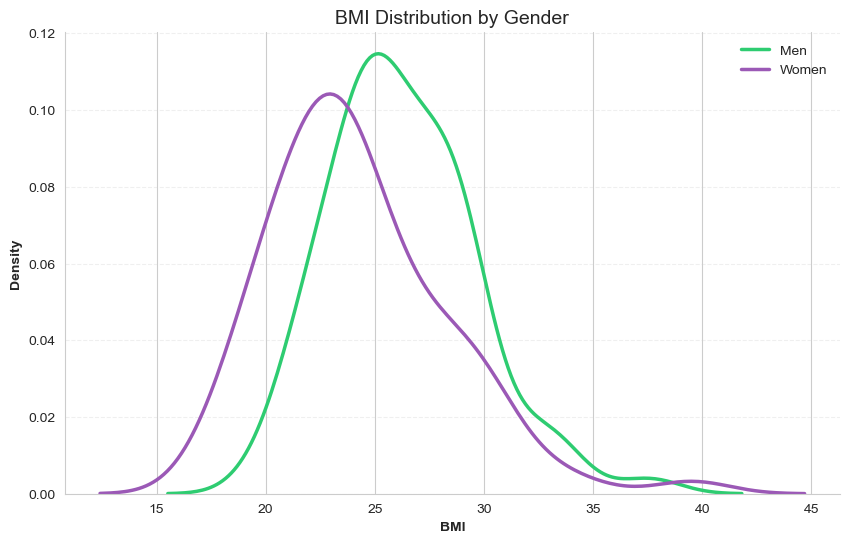

# BMI Survey Analysis Report  
**Author**: [Your Name]  

---

## Part 1: Descriptive Analysis  

### Q1. Data Overview  

#### a) Short Description of the Data  
**Variables**:  
- `height`: Quantitative (likely in cm or m)  
- `weight`: Quantitative (likely in kg)  
- `gender`: Categorical (integer codes, e.g., 0=Male, 1=Female)  
- `urbanity`: Ordinal categorical (1-5, representing rural to major city)  
- `fastfood`: Quantitative (days per year eating fast food, 0-365)  

**Observations**:  
- Total observations: 145  
- Missing values: **None** (all columns have 145 non-null entries).  

---

### Q2. Calculating BMI  

BMI was computed using weight (kg) and height (m) with the formula:  
  $$\text{BMI} = \frac{\text{weight (kg)}}{\left[\text{height (m)}\right]^2}$$

Height values were converted from centimeters to meters before calculation. The resulting `bmi` variable ranged from **17.58** (underweight) to **39.52** (obesity class II), covering all major weight categories.   

---

### 3. Empirical Distribution of BMI  
#### b) Density Histogram of BMI Scores  
*Figure 1* displays the density histogram of BMI scores. The distribution is **unimodal and right-skewed**, with the majority of observations clustered between BMI 20-30 (peak density at ~ 23 & 25). No negative values are present, as expected for BMI.  
A few potential outliers exist beyond BMI 35, indicating higher obesity levels in a small subset. The KDE curve (red) reinforces this skewness, showing a gradual decline in density for higher BMIs.  

  

---

### 4. Gender Subsets  
#### c) Density Histograms for Women and Men  
*Figure 2* compares BMI distributions between genders using density histograms. Key observations:  
- **Right-skewed distributions**: Both groups show a tail toward higher BMIs, though the skew is more pronounced in women.  
- **Peak differences**: Women’s BMI peaks near 24, while men’s distribution centers around 26.  
- **Variation**: Women exhibit slightly wider spread (BMI ~18-40) compared to men (~20-35), indicating greater variability.  

No negative BMI values are present, consistent with physiological plausibility.  

  

---

### 5. Boxplot by Gender  
#### d) Box Plot of BMI by Gender  
*Figure 3* compares BMI distributions between genders using boxplots. Key observations:  
- **Median BMI**: Men (green) have a lower median (~24) compared to women (purple, ~26).  
- **Spread**: Women’s BMI shows a larger interquartile range (IQR) and longer upper whisker, indicating greater variability and right-skewness.  
- **Outliers**: Two outliers (>35 BMI) are observed in the women’s group.  

  
---

### 6. Summary Statistics  
#### e) Key Summary Statistics for BMI  

**Table 1** summarizes BMI statistics for all respondents, men, and women:  

| Statistic   | All    | Men    | Women  |
|-------------|--------|--------|--------|
| **n**       | 145.00 | 73.00  | 72.00  |
| **Mean**    | 25.25  | 24.22  | 26.27  |
| **Variance**| 14.69  | 11.07  | 16.41  |
| **Std. Dev.**| 3.83  | 3.33   | 4.05   |
| **Q1**     | 22.59  | 21.26  | 24.15  |
| **Median** | 24.69  | 23.69  | 25.73  |
| **Q3**     | 27.64  | 26.29  | 28.63  |

**Key Findings**:  
- **Gender Differences**: Women exhibit a higher mean BMI (26.27 vs. 24.22) and greater variability (variance: 16.41 vs. 11.07).  
- **Skewness**: Mean > median for all groups (*All*: 25.25 vs. 24.69), reinforcing the right-skewed distributions observed in earlier plots.  
- **Spread**: Women’s wider interquartile range (Q3-Q1: 4.48 vs. 5.03) aligns with their higher standard deviation (4.05).  

This table quantifies trends seen in visualizations (e.g., higher central tendency and spread for women in *Figure 3*).  

---

## Part 2: Missing Values, Outliers, and Bivariate EDA  

### 1. Missing Values  
**Findings**:  
- **No missing values** were detected in any variable (`height`, `weight`, `gender`, `urbanity`, `fastfood`, `bmi`).  
- All 145 observations are complete.  

**Handling Strategy**:  
- No action required (no imputation/removal needed).  
- **Justification**: Complete datasets preserve statistical power and avoid bias from deletion/imputation assumptions.  

**Observations Before/After Handling**:  
- Observations remain unchanged (**145** → **145**).

---
### 2. Outlier Detection and Handling  
#### a) Identifying Outliers  

**Methods**:  
1. **IQR Rule** (1.5×IQR):  
   - Outliers defined as values outside [Q1 - 1.5IQR, Q3 + 1.5IQR].  
2. **Z-Score** (threshold = ±3):  
   - Outliers defined as values with |z-score| > 3.  

**Results**:  
| Variable | IQR Outliers | IQR Bounds       | Z-Score Outliers |  
|----------|--------------|------------------|------------------|  
| BMI      | 2            | 15.01 – 35.22    | 2                |  
| Height   | 0            | 142.00 – 206.00  | 0                |  
| Weight   | 1            | 32.00 – 120.00   | 1                |  

**Visualization**:

  
- *Figure 4* (`boxplots_bmi_height_weight.png`) shows boxplots for all three variables.
 
 

  
- *Figure 5* (`iqr_outlier_boundaries_bmi_height_weight.png`) displays scatter plots with IQR outlier thresholds.  

**Plausibility Assessment**:  
- **BMI outliers** (>35.22): Align with WHO’s obesity class II (BMI ≥35).  
- **Weight outlier** (>120 kg): Plausible for severe obesity cases.  
- **Height**: No outliers detected (all values within normal human ranges).  

---

#### b) Handling Outliers  
**Decision**: Retain all outliers.  

**Justification**:  
1. **Biological plausibility**: Extreme BMI/weight values reflect real-world obesity cases.  
2. **No measurement errors**: No evidence of data entry mistakes (e.g., height outliers would require implausible values like <1.4m or >2.0m).  
3. **Minimal impact**: Removing 3/145 observations (~2%) would reduce statistical power without meaningful benefit.  

**Effect**: Dataset retains all 145 observations.  

---

### 3. Bivariate Exploratory Data Analysis (EDA)  
#### a) BMI and Fast Food Consumption  
*(Scatter plot, correlation, and interpretation)*  

#### b) BMI by Gender  
*(Boxplot/violin plot and significance testing)*  

#### c) BMI by Urbanity  
*(Visualization and trends)*  

#### d) Additional Bivariate Relationships  
*(Exploration of other variable pairs)*  

---

### 4. Summary  
*(Key findings and impact on analysis reliability)*  

---

## Appendix: Code  
*(You’ll add your code here at the end, as per lab instructions)*  